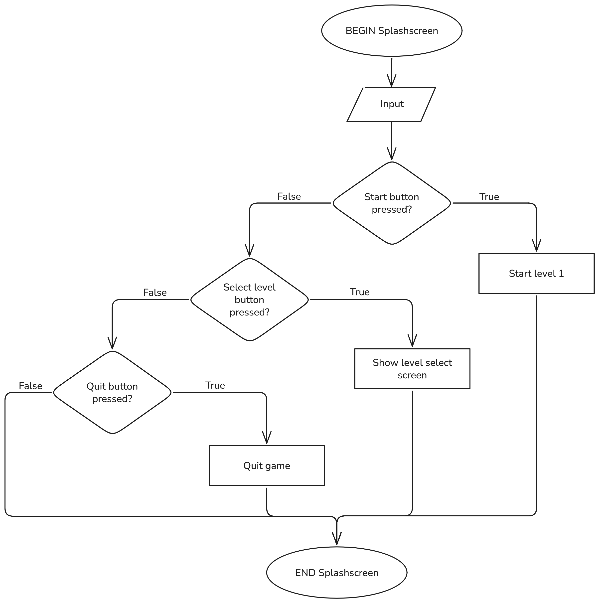
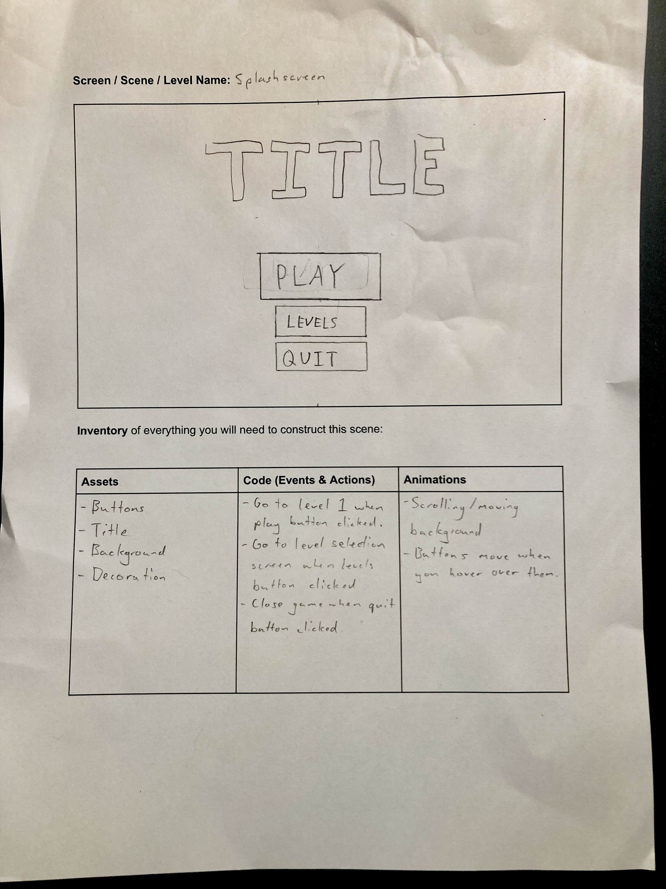
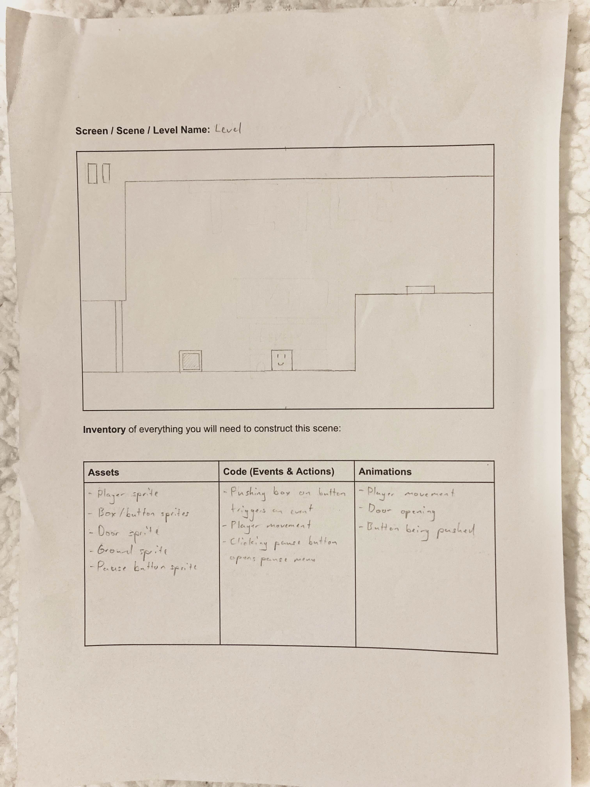

# Software Design Project Proposal
### Fraser Maple

## Identifying and Defining

### My Idea

I want to create a puzzle-platformer game in which the player must push boxes onto buttons in order to progress, however, there's a twist: the player can swap positions with the box at any time, opening the door to countless new and exciting puzzles.

### Identifying a Need

**Need:** To sharpen and challenge the player's problem-solving abilities and platforming skills.

**Problem Statement:** Many video games require little thinking and problem-solving. A puzzle-platformer game is the perfect game to enchance the player's problem-solving and thinking skills.

**Skill Development:** To develop the skills in Unity required to create the game, I will use my knowledge gained from my previous Unity game, paired with some extra research for any additional functionalities that my game may require.

### Requirements Outline

**Inputs:** User inputs will include WASD or arrow keys for movement, and spacebar for jumping. It will also include a key for the special action of switching positions with the box.

**Processing:** The game will check for any collisions, calculate the player's position, and check if the player is at the end of the level.

**Outputs:** The game will update the position of the player, and will go to the next level if the player is at the end of the level.

**Storage:** The game will store which levels have been completed, along with the fastest completion times for each level.

### Functional and Non-Functional Specifications

#### Functional Requirements

**User Interaction:** The user will interact with my game via keyboard and mouse controls. The user will be able to move the player using WASD/arrow keys and jump with space bar. The mouse will be used to click buttons on the splash screen.

**Core Gameplay or Simulation Mechanics:** The game will move the player in response to the user's inputs and will, go to the next level when the player is at the end.

**Score and Feedback:** A timer will begin at the start of each level, and stop at the end of each level. The game will store the user's best times.

**Level Progression:** The user will progress to the next level once they reach a dedicated ending area of the level.

**Saving and Loading Data:** The game will store which levels have been completed so the user can replay those levels without having to play all of the previous levels. The game will also keep track of the fastest completion times for each level.

#### Non-Functional Requirements

**Performance Requirements:** The game should be relatively quick to load each level, and the gameplay shouldnt have any noticible lag.

**Usability Requirements:** The game should have a main menu/splash screen and a level selection screen.

**Scalability Requirements:** The game should be scalable to include new levels without an impact on the existing levels.

### Social and Ethical Issues

**Definitions:**

Equity - Being fair and just in the way people are treated. \
Accessibility - Designing porducts in a way that allows then to be accessed by anyone.

**Accessibility:** My game should be pretty accessible without the need for special considerations due to its simplistic nature and minimal controls.

**Privacy and Data Protection:** I will ensure that any data collected such as best times and the levels that have been completed will remain stored securely.

**Fairness and Representation:** My characters will likely not be human, so there isn't much of an opportunity to include diverse characters, or to portray harmful stereotypes.

**Mental and Emotional Well-being:** Players may get frustrated if they cannot solve the puzzles, but otherwise the game will not have any effect on the player's mental or emotional wellbeing.

**Cultural Sensitivities:** My game will not include any themes or symbols that may be offensive or culturally insensitive.

# Researching and Planning

## Exploration of Existing Ideas


## Flowcharts and Pseudocode

### Movement


```
BEGIN Movement
    INPUT Input
    IF 'A' or '←' pressed THEN
        Move player left
    ELSE IF 'D' or '→' pressed THEN
        Move player right
    ELSE IF 'W' or '↑' or 'space' pressed THEN
        IF Touching ground THEN
            Make player jump
        END IF
    END IF
END Movement 
```

### Next Level


```
BEGIN Next Level
    DO
        Nothing
    UNTIL At end of level IS TRUE
    Stop timer
    IF Time better than best THEN
        Update best time for level
    END IF
    Go to next level
END Next Level
```

### Splashscreen



```
BEGIN Splashscreen
    INPUT input
    IF Start button pressed THEN
        Start level 1
    ELSE IF Select level button pressed THEN
        Show level select screen
    ELSE IF Quit button pressed THEN
        Quit game
    END IF
END Splashscreen
```

### Pause menu


```
BEGIN Pause menu
    INPUT Input
    IF Continue button pressed THEN
        Close pause menu
    ELSE IF Back to main menu button pressed THEN
        Go to splashscreen
    END IF
END Pause menu
```

## Storyboards

### Whole Game


### Splashscreen



### Level



## Gantt Chart

